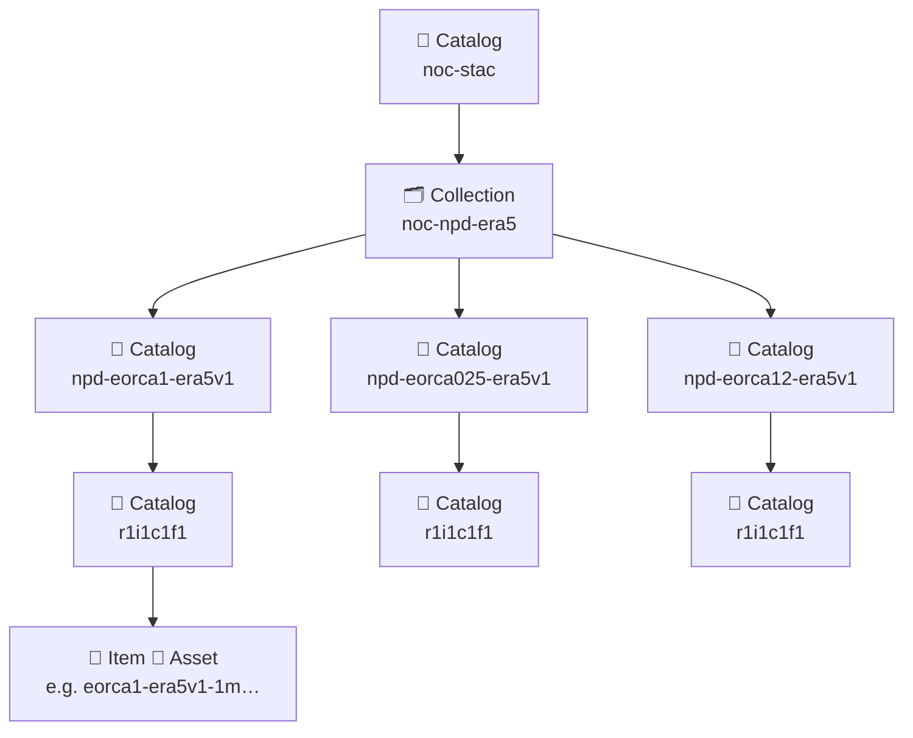

# OceanDataStore - Discover :material-cloud-download:

This is a User Guide for using the **OceanDataCatalog** to search, access and analyse our publicly available Analysis-Ready Cloud Optimsed (ARCO) ocean datasets.

---

## What is the OceanDataCatalog?

**OceanDataCatalog** is a Python API which allows users to:

* Explore the OceanDataCatalog Spatio-Temporal Access Catalog ([**STAC**](https://stacspec.org/en)) containing collections of publicly available ocean model outputs stored in the JASMIN Object Store.
* Search by collection of ocean data (e.g., EN4.2.2), standard variable names or data type (e.g., model / observation).
* Access & subset Analysis-Ready Cloud-Optimised ([**ARCO**](https://doi.org/10.1109/MCSE.2021.3059437)) datasets as lazy [**xarray**](https://docs.xarray.dev/en/stable/user-guide/data-structures.html) Datasets.

## Background

### What is STAC?

Spatio-Temporal Asset Catalogs (**STAC**) provides a standardized way to describe geospatial and temporal data so that it can be easily discovered & shared across many different platforms. 

A STAC catalog organises datasets as a **Collection** of **Items** — each representing a geospatial asset (e.g., a model output file or satellite image) — and describes their spatial and temporal extent through structured metadata.

STAC is intentionally simple and extensible: it builds on widely used web standards (JSON and GeoJSON) and can describe geospatial assets stored in diverse formats, including large, cloud-optimized Zarr stores & Icechunk repositories.

Behind the **OceanDataCatalog** API, STAC catalogs are used to describe publicly available ocean model outputs produced by the National Oceanography Centre.

#### STAC Basics:

📁 **Catalog** — Container storing STAC **Collections** or other **Catalogs** - provides high-level metadata about its contents.

🗂️ **Collection** — Group of related **Items** that share common metadata, such as a modelling activity or model configuration.

📄 **Item** — Single spatio-temporal record within a Collection, typically representing one dataset instance (e.g., a model output file / dataset). Each **Item** includes geometry, timestamps, and links to a data **Asset**.

🧩 **Asset** — Actual data or file associated with an **Item**, such as a Zarr Store, NetCDF file, or Icechunk repository. **Assets** include URLs and media types which determines how data can be accessed.

### NOC Ocean Modelling + STAC

National Oceanography Centre ocean model outputs are organised in the `odc-stac` **Catalog**, which serves as the highest-level STAC object in our hierarchy.

The `odc-stac` **Catalog** is comprised of STAC **Collections** which group **Items** belonging to the same ocean modelling activity. In the example above, we have included the NOC Near-Present Day simulations produced using bias-corrected ERA-5 atmospheric forcing in the `noc-npd-era5` **Collection**.

The `noc-npd-era5` **Collection** contains three **Catalogs** corresponding to the three ocean sea-ice hindcast configurations (i.e., eORCA1, eORCA025, eORCA12) of the NOC Near-Present Day hierarchy.

Each `npd-eorca{}-era5v1` **Catalog** in-turn contains one or more variant **Catalogs** containing the outputs associated with an individual ocean sea-ice hindcast simulation. Variant labels use a similar nomenclature to the Coupled Model Intercomparison Project (CMIP); `r1i1c1f1` corresponds to Realisation = 1, Initialisation = 1, Configuration = 1, and Forcing = 1, where integers > 1 correspond to a variant of the original ocean sea-ice configuration.

Finally, each variant **Catalog** contains one or more **Items** associated with an Icechunk repository (**Asset**) containing time-mean NEMO ocean model outputs at a specified frequency. See the table below for annual, monthly and 5-daily mean examples:

| Example     | Model               |   Frequency   |
| ----------- | ------------------ | --------------|
| `eorca1-era5v1-1y` | eORCA1 ERA5v1  |  Annual Means |
| `eorca025-era5v1-1m` | eORCA025   | Monthly Means |
| `eorca12-era5v1-5d` | eORCA12  | 5-day Means   |

To improve the accesibility of our ocean model data, each **Item** is given a unique path-like identifier describing its relationship within the wider `odc-stac` **Catalog**.

For example, `noc-npd-era5/npd-eorca1-era5v1/r1i1c1f1/eorca1-era5v1-1m` identifies the **Item** containing monthly-mean variables for the eORCA1-ERA5v1 (1-degree) simulation contained in the NOC Near-Present Day ERA-5 **Collection**.
