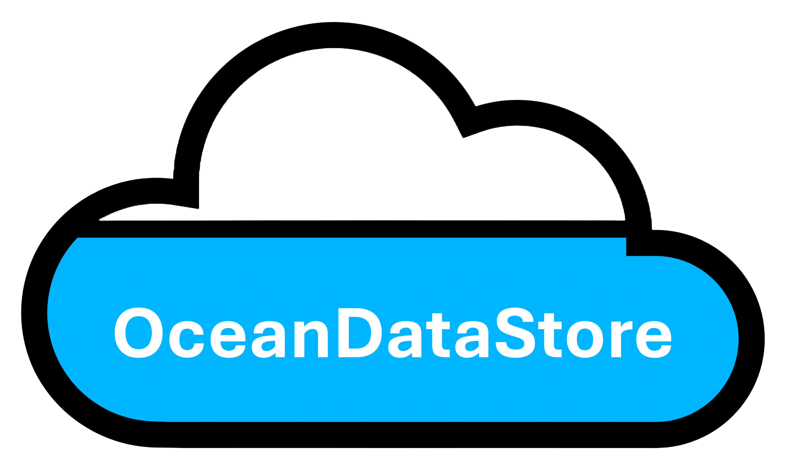

# OceanDataStore



## About

**OceanDataStore** is an open-source Python library for creating, publishing, discovering, and accessing cloud-native ocean datasets.

### :material-cloud-upload: Writing Ocean Data to Cloud Object Storage

For writing and updating files to S3-compatibible cloud object stores (e.g., [**JASMIN Object Store**](https://help.jasmin.ac.uk/docs/short-term-project-storage/using-the-jasmin-object-store/)), OceanDataStore includes a **commmand line interface (CLI)** with the following commands:

* **send_to_zarr**: Send local file(s) to a new zarr store in cloud object storage.
* **update_zarr**: Update an existing zarr store in cloud object storage with local file(s). 
* **send_to_icechunk**: Send local file(s) to a new Icechunk repository in cloud object storage.
* **update_icechunk**: Update an existing Icechunk repostitory in cloud object storage with local file(s).
* **list**: List the objects found in a cloud object store bucket.


### :material-cloud-download: Accessing Ocean Data in Cloud Object Storage

To access ocean model and observational data stored in cloud object storage, OceanDataStore includes the **OceanDataCatalog API** with the following features:

* Interfaces with a Spatio-Temporal Access Catalog ([**STAC**](https://stacspec.org/en)) to expose available collections of ocean model & observational data stored in the JASMIN Object Store.
* Search catalogs by collection, variable names or platform (grid type).
* Subset & open Analysis-Ready Cloud Optimised ([**ARCO**](https://doi.org/10.1109/MCSE.2021.3059437)) datasets as lazy [**xarray**](https://docs.xarray.dev/en/stable/user-guide/data-structures.html) Datasets.

To get started exploring our publicly available ocean data, visit our interactive **[Catalog Browser]**.

---

## Quick Start :rocket:

### Installation

We recommend downloading and installing **OceanDataStore** into a new virtual environment via GitHub.

After activating a new virtual environment, pip install **OceanDataStore** from GitHub:
```{bash}
pip install oceandatastore
```

Alternatively, users can install **OceanDataStore** (including the latest commits) via GitHub:

```{bash}
pip install git+https://github.com/NOC-MSM/OceanDataStore.git
```

??? tip "Helpful Tip..."

    * **We strongly recommend setting-up a virtual environment before installing **OceanDataStore** with pip.**

    The simplest way to create a new virtual environment is to use venv:

    ```sh
    python3 -m venv "env_ods"
    ```

    Alternatively, using an existing miniconda, mamba or miniforge installation:

    ```sh
    conda env create -n env_ods python=3.13
    ```

---

### Learning More...

* To browse the publicly available ocean model outputs generated by the National Oceanography Centre, visit our **[Catalog Browser]**.

* To get started accessing ocean model outputs using our Python API, visit our **[OceanDataCatalog]** page.

* To learn more about writing ocean data to cloud object storage using the OceanDataStore CLI, visit our **[CLI User Guide]**.

* To explore some typical OceanDataStore CLI workflows, visit our **[CLI Examples]** page.

[Catalog Browser]: catalog.md
[CLI User Guide]: cli_guide.md
[OceanDataCatalog]: catalog_guide.md
[CLI Examples]: examples.md
