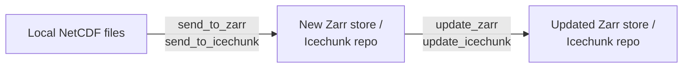

# OceanDataStore - Publish :material-cloud-upload:

This is a User Guide for using **OceanDataStore** to publish local NetCDF files into cloud-native Zarr stores or Icechunk repositories in S3-compatible object stores.

---

## Publish Lifecycle

OceanDataStore supports a two-stage data publishing workflow:

* Create a Zarr store or Icechunk repository once...
* ...Extend it as new data arrives.

Users can publish data to Analysis-Ready Cloud-Optimised formats using **OceanDataStore** from the command line or using Python scripts.

---

## Background

### A Brief Introduction to Zarr

Zarr is an open source, flexible and efficient storage format designed for chunked, compressed, N-dimensional arrays. At its simplest, Zarr can be considered a cloud-native alternative to netCDF files since it consists of binary data files (chunks) accompanied by external metadata files.

One important difference between archival file formats (e.g., netCDF) and Zarr is that there is no single Zarr file. Instead, a Zarr store (typically given the suffix .zarr - although this is not a requirement) is a directory containing chunks of data stored in compressed binary files and JSON metadata files containing the array configuration and compression used.

Zarr works especially well in combination with cloud storage, such as the JASMIN object store, given that users can access data concurrently from multiple threads or processes using Python or a number of other programming languages.

**[Click here](https://zarr-specs.readthedocs.io/en/latest/specs.html)** for more information on the Zarr specification.

### A Brief Introduction to Icechunk

Icechunk is an open-source, cloud-native transactional tensor storage engine designed for N-dimensional data in cloud object storage. At its simplest, Icechunk can be considered a "transactional storage engine for Zarr", meaning that Icechunk manages all of the I/O for reading, writing and updating metadata and chunk data & keeps track of changes (referred to as transactions) to the store in the form of snapshots. 

In place of Zarr store, users create an Icechunk repository, which functions as both a self-contained Zarr store and a database of the snapshots resulting from transactions (e.g., updating values or writing new values in the store). 

This allows Icechunk repositories to support data version control, since users can time-travel to previous snapshots of a repository.

**[Click here](https://icechunk.io/en/latest/overview/)** for an overview of Icechunk.

---

## Next Steps

* [How-To Guide](publish_howto.md) — concise how-to-guide of the most common OceanDataStore publishing operations
* [Examples](publish_examples.md) — End-to-end examples of publishing datasets with OceanDataStore
* [CLI Reference](cli_reference.md) — complete reference to the available flags when using the OceanDataStore CLI
